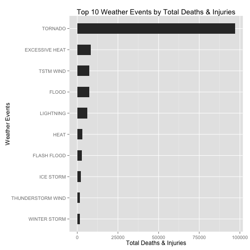
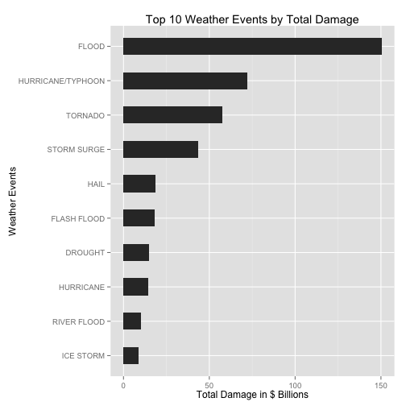

###Synopsis
For the United States between 1950 and 2011 and using data from the [NOAA Storm Database](https://d396qusza40orc.cloudfront.net/repdata%2Fdata%2FStormData.csv.bz2) I isolated the weather events responsible for the most Deaths and Injuries and also the events responsible for the greatest economic harm.

In terms of Death and Injuries, Tornados were far and away the biggest cause of totalled death and injuries. They were responsible for 96,979 deaths and injuries or 62% of the total.

In terms of Economic Damage, Flooding is the top weather event.  Flooding was responsible for over $150B in damages or 31% of the total for the dataset.

Despite the dangers of Tornados and Floods pose to residence of the Unitied States, there is not a single law making these events illegal. Based on this analysis I would strongly encourage the legislature to outlaw Torandos and Floods to save lives and economic resources.

###Data Processing
*Load Required Libraries*

```r
library(ggplot2)
library(car) #recode()
library(dplyr)
```

*Import Data*

```r
# Set Working directory
# Edit as necessary
setwd("~/GitHub/RepData_PeerAssessment2")

# Import Data
data.raw = read.csv(bzfile("repdata-data-StormData.csv.bz2")) #Can read .bz2 files directly with bzfile()
```

*Isolate Required Columns*

```r
# Isolate Required Columns
data.analysis = data.raw[ ,c('EVTYPE', 'FATALITIES', 'INJURIES', 'PROPDMG', 'CROPDMG', 'PROPDMGEXP', 'CROPDMGEXP')]
head(data.analysis)
```

```
##    EVTYPE FATALITIES INJURIES PROPDMG CROPDMG PROPDMGEXP CROPDMGEXP
## 1 TORNADO          0       15    25.0       0          K           
## 2 TORNADO          0        0     2.5       0          K           
## 3 TORNADO          0        2    25.0       0          K           
## 4 TORNADO          0        2     2.5       0          K           
## 5 TORNADO          0        2     2.5       0          K           
## 6 TORNADO          0        6     2.5       0          K
```

*Standardize Values and Magnitude*
Property Damage (PROPDMG) and Crop Damage (CROPDMG) are the estimated financial damage caused.  The value magnitudes are determined by the characters in the fields PROPDMGEXP and CROPDMGEXP according to the [data documentation](https://d396qusza40orc.cloudfront.net/repdata%2Fpeer2_doc%2Fpd01016005curr.pdf) provided, see Section 2.7 Damage. I am assuming a mapping value of 1 for the non-alphanumeric values and assuming that numerical values are the number of significant digits used in scientific notation.

Value | Mapping
----- | -------
'' | 1
- | 1
? | 1
+ | 1
B | Billions
h | Hundreds
H | Hundreds
K | Thousands
M | Millions
m | Millions
0-9 | Significant Digits


```r
#Recode PROPDMGEXP values
data.analysis$PROPDMGEXP = as.numeric(
  recode(data.analysis$PROPDMGEXP, "
    c('-','?','+','') = 1;
    c('h','H') = 1e+02;
    c('k','K') = 1e+03;
    c('m','M') = 1e+06;
    c('b','B') = 1e+09;
    '0' = 1; 
    '1' = 10;
    '2' = 1e+02; 
    '3' = 1e+03; 
    '4' = 1e+04; 
    '5' = 1e+05;
    '6' = 1e+06; 
    '7' = 1e+07; 
    '8' = 1e+08;
    ", as.factor.result = FALSE
  )
)

#Update PROPDMG values with new mumeric PROPDMGEXP values
data.analysis$PROPDMG = data.analysis$PROPDMG * data.analysis$PROPDMGEXP

#Recode CROPDMGEXP values
data.analysis$CROPDMGEXP = as.numeric(
  recode(data.analysis$CROPDMGEXP, "
    c('-','?','+','') = 1;
    c('h','H') = 1e+02;
    c('k','K') = 1e+03;
    c('m','M') = 1e+06;
    c('b','B') = 1e+09;
    '0' = 1; 
    '1' = 10;
    '2' = 1e+02; 
    '3' = 1e+03; 
    '4' = 1e+04; 
    '5' = 1e+05;
    '6' = 1e+06; 
    '7' = 1e+07; 
    '8' = 1e+08;
    ", as.factor.result = FALSE
  )
)

#Update CROPDMG values with new mumeric CROPDMGEXP values
data.analysis$CROPDMG = data.analysis$CROPDMG * data.analysis$CROPDMGEXP
head(data.analysis)
```

```
##    EVTYPE FATALITIES INJURIES PROPDMG CROPDMG PROPDMGEXP CROPDMGEXP
## 1 TORNADO          0       15   25000       0       1000          1
## 2 TORNADO          0        0    2500       0       1000          1
## 3 TORNADO          0        2   25000       0       1000          1
## 4 TORNADO          0        2    2500       0       1000          1
## 5 TORNADO          0        2    2500       0       1000          1
## 6 TORNADO          0        6    2500       0       1000          1
```

*Add Totals for Damage and Health*

```r
#Add PROPDMG + CROPDMG as TOTALDMG
data.analysis$TOTALDMG = data.analysis$PROPDMG + data.analysis$CROPDMG

#Add FATALITIES + INJURIES as TOTALDEATHINJ
data.analysis$TOTALDEATHINJ = data.analysis$FATALITIES + data.analysis$INJURIES
head(data.analysis)
```

```
##    EVTYPE FATALITIES INJURIES PROPDMG CROPDMG PROPDMGEXP CROPDMGEXP
## 1 TORNADO          0       15   25000       0       1000          1
## 2 TORNADO          0        0    2500       0       1000          1
## 3 TORNADO          0        2   25000       0       1000          1
## 4 TORNADO          0        2    2500       0       1000          1
## 5 TORNADO          0        2    2500       0       1000          1
## 6 TORNADO          0        6    2500       0       1000          1
##   TOTALDMG TOTALDEATHINJ
## 1    25000            15
## 2     2500             0
## 3    25000             2
## 4     2500             2
## 5     2500             2
## 6     2500             6
```

*Summarize Health and Damage*
The summerized datasets will be used in the analysis below

```r
#Create .health dataset, Remove EXP columns for clean summerization
data.analysis.health = data.analysis[ ,c('EVTYPE','FATALITIES','INJURIES','TOTALDEATHINJ')]

#Create .damage dataset, Remove EXP columns for clean summerization
data.analysis.damage = data.analysis[ ,c('EVTYPE','PROPDMG','CROPDMG','TOTALDMG')]

#Summerize Health using dplyr
data.analysis.health.sum = 
  data.analysis.health %>%
  group_by(EVTYPE) %>%
  summarise_each(funs(sum)) %>%
  arrange(desc(TOTALDEATHINJ))

head(data.analysis.health.sum)
```

```
## Source: local data frame [6 x 4]
## 
##           EVTYPE FATALITIES INJURIES TOTALDEATHINJ
## 1        TORNADO       5633    91346         96979
## 2 EXCESSIVE HEAT       1903     6525          8428
## 3      TSTM WIND        504     6957          7461
## 4          FLOOD        470     6789          7259
## 5      LIGHTNING        816     5230          6046
## 6           HEAT        937     2100          3037
```

```r
#Summerize Damage using dplyr
data.analysis.damage.sum = 
  data.analysis.damage %>%
  group_by(EVTYPE) %>%
  summarise_each(funs(sum)) %>%
  arrange(desc(TOTALDMG))

head(data.analysis.damage.sum)
```

```
## Source: local data frame [6 x 4]
## 
##              EVTYPE      PROPDMG    CROPDMG     TOTALDMG
## 1             FLOOD 144657709807 5661968450 150319678257
## 2 HURRICANE/TYPHOON  69305840000 2607872800  71913712800
## 3           TORNADO  56947380676  414953270  57362333946
## 4       STORM SURGE  43323536000       5000  43323541000
## 5              HAIL  15735267513 3025954473  18761221986
## 6       FLASH FLOOD  16822673978 1421317100  18243991078
```


###Results 
####1. Across the United States, which types of events (as indicated in the `EVTYPE` variable) are most harmful with respect to population health?
To answer this I utilized the `data.analysis.health.sum` summary table that sums the deaths and injuries by `EVTYPE` ordered descending. Additionally I isolated the top 10 causes of Total Death & Injuries and calculated the proportion they make as a percentage of the whole.  


```r
#Top 10 Events
data.analysis.health.sum[1:10, ]
```

```
## Source: local data frame [10 x 4]
## 
##               EVTYPE FATALITIES INJURIES TOTALDEATHINJ
## 1            TORNADO       5633    91346         96979
## 2     EXCESSIVE HEAT       1903     6525          8428
## 3          TSTM WIND        504     6957          7461
## 4              FLOOD        470     6789          7259
## 5          LIGHTNING        816     5230          6046
## 6               HEAT        937     2100          3037
## 7        FLASH FLOOD        978     1777          2755
## 8          ICE STORM         89     1975          2064
## 9  THUNDERSTORM WIND        133     1488          1621
## 10      WINTER STORM        206     1321          1527
```

```r
#Calc Specific Sums and %
AllUp.DeathInj = sum(data.analysis.health.sum$TOTALDEATHINJ)
Top10.DeathInj = sum(data.analysis.health.sum[1:10,4])
PrctTop10.DeathInj = Top10.DeathInj/AllUp.DeathInj
TopEVTYPE.DeathInj = sum(data.analysis.health.sum[1,4])
PrctTopEVTYPE.DeathInj = TopEVTYPE.DeathInj/AllUp.DeathInj
```

Tornados cause the vast majority of death and injuries in the United States between 1950 and 2011. They were responsible for 9.6979 &times; 10<sup>4</sup> or 62.3% of all Deaths and Injuries.


```r
ggplot(data.analysis.health.sum[1:10, ]) +
  geom_bar(aes(reorder(EVTYPE, TOTALDEATHINJ, sum), y=TOTALDEATHINJ), width=0.5, stat="identity") +
  coord_flip() +
  ggtitle("Top 10 Weather Events by Total Deaths & Injuries") +
  ylab("Total Deaths & Injuries") +
  xlab("Weather Events")
```

 

####2. Across the United States, which types of events have the greatest economic consequences?
To answer this I utilized the `data.analysis.damage.sum` summary table that sums the total damage (`PROPDMG` + `CROPDMG` as `TOTALDMG`) by `EVTYPE` ordered descending.  Additionally I isolated the top 10 causes of Total Damage and calculated the proportion they make as a percentage of the whole.


```r
#Top 10 Events
data.analysis.damage.sum[1:10, ]
```

```
## Source: local data frame [10 x 4]
## 
##               EVTYPE      PROPDMG     CROPDMG     TOTALDMG
## 1              FLOOD 144657709807  5661968450 150319678257
## 2  HURRICANE/TYPHOON  69305840000  2607872800  71913712800
## 3            TORNADO  56947380676   414953270  57362333946
## 4        STORM SURGE  43323536000        5000  43323541000
## 5               HAIL  15735267513  3025954473  18761221986
## 6        FLASH FLOOD  16822673978  1421317100  18243991078
## 7            DROUGHT   1046106000 13972566000  15018672000
## 8          HURRICANE  11868319010  2741910000  14610229010
## 9        RIVER FLOOD   5118945500  5029459000  10148404500
## 10         ICE STORM   3944927860  5022113500   8967041360
```

```r
#Calc Specific Sums and %
AllUp.Damage = sum(data.analysis.damage.sum$TOTALDMG)
Top10.Damage = sum(data.analysis.damage.sum[1:10,4])
PrctTop10.Damage = Top10.Damage/AllUp.Damage
TopEVTYPE.Damage = sum(data.analysis.damage.sum[1,4])
PrctTopEVTYPE.Damage = TopEVTYPE.Damage/AllUp.Damage
```

Flooding is responsible for the vast majority of Total Damage in the United States between 1950 and 2011.  Floods were responsible for $150.3B in Total Damages or 31.5% of all Damage Types.


```r
ggplot(data.analysis.damage.sum[1:10, ]) +
  geom_bar(aes(reorder(EVTYPE, TOTALDMG, sum), y=TOTALDMG/1e+09), width=0.5, stat="identity") +
  coord_flip() +
  ggtitle("Top 10 Weather Events by Total Damage") +
  ylab("Total Damage in $ Billions") +
  xlab("Weather Events")
```

 


